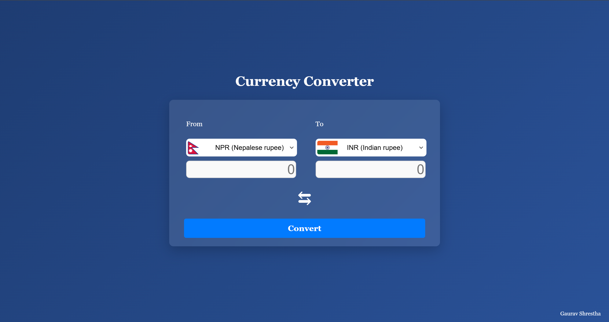

# Currency Converter

A simple and interactive currency converter web application that allows users to convert amounts between different currencies using real-time exchange rates. The app fetches currency data from the [ExchangeRate-API](https://www.exchangerate-api.com/) and country data from the [REST Countries API](https://restcountries.com/).

## Features

- **Real-Time Exchange Rates**: Fetches the latest exchange rates from the ExchangeRate-API.
- **Currency Dropdowns**: Populates dropdowns with currencies and their corresponding countries.
- **Flag Display**: Displays the flag of the selected currency's country.
- **Swap Currencies**: Allows users to swap the "From" and "To" currencies with a single click.
- **Responsive Design**: Works seamlessly on both desktop and mobile devices.
- **Error Handling**: Displays notifications for errors or invalid inputs.

## Technologies Used

- **HTML5**: For structuring the web page.
- **CSS3**: For styling the application.
- **JavaScript (ES6+)**: For dynamic functionality and API interactions.
- **ExchangeRate-API**: For fetching real-time exchange rates.
- **REST Countries API**: For fetching country and currency data.

## Setup Instructions

### Prerequisites

1. **API Key**: Sign up at [ExchangeRate-API](https://www.exchangerate-api.com/) to get your free API key.
2. **Web Browser**: Ensure you have a modern web browser like Chrome, Firefox, or Edge.

### Steps to Run the Project

1. **Clone the Repository**:

2. **Add Your API Key**:

   - Create a file named `key.js` in the project root directory.
   - Add the following code to `key.js`:
     ```javascript
     export const API_KEY = "your-api-key-here";
     ```

3. **Open the Project**:

   - Open the `index.html` file in your browser.

4. **Use the Application**:
   - Select the "From" and "To" currencies.
   - Enter the amount to convert.
   - Click the "Convert" button to see the result.

## Code Structure

- **`index.html`**: The main HTML file containing the structure of the application.
- **`style.css`**: The CSS file for styling the application.
- **`script.js`**: The JavaScript file containing the logic for fetching data, handling user interactions, and performing currency conversions.
- **`key.js`**: A separate file to store the API key (not included in the repository for security reasons).

## Key Functions

1. **`fetchCountriesData`**:

   - Fetches country data from the REST Countries API and groups countries by currency.

2. **`populateDropdown`**:

   - Populates the "From" and "To" currency dropdowns with the fetched data.

3. **`convertCurrency`**:

   - Converts the entered amount from the "From" currency to the "To" currency using real-time exchange rates.

4. **`handleSwap`**:

   - Swaps the "From" and "To" currencies and updates the displayed flags.

5. **`showNotification`**:
   - Displays a notification message for errors or successful conversions.

## Example Usage

1. Select "NPR" (Nepalese Rupee) as the "From" currency.
2. Select "INR" (Indian Rupee) as the "To" currency.
3. Enter an amount (e.g., 100) in the "From" input field.
4. Click "Convert" to see the equivalent amount in the "To" currency.

## Screenshots



## Author

- **Gaurav Shrestha**
- GitHub: [gauravshresthaofficial](https://github.com/gauravshresthaofficial)
